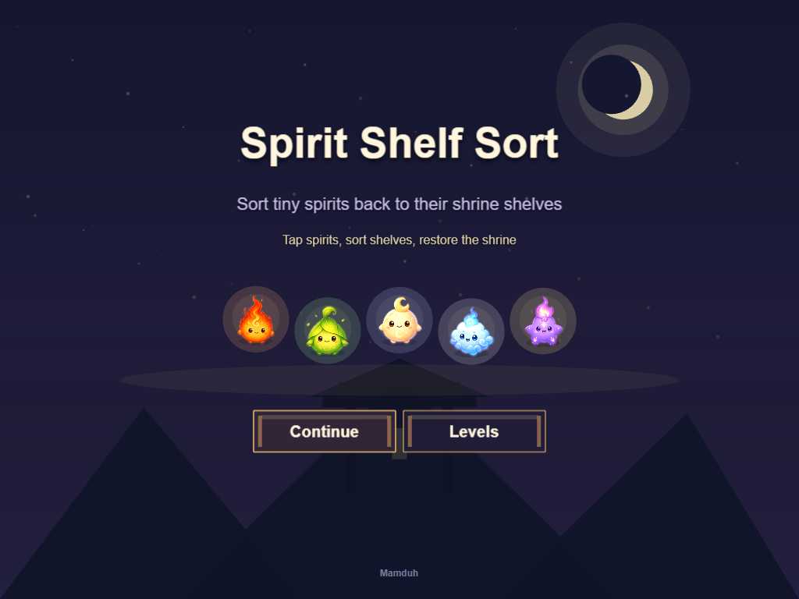
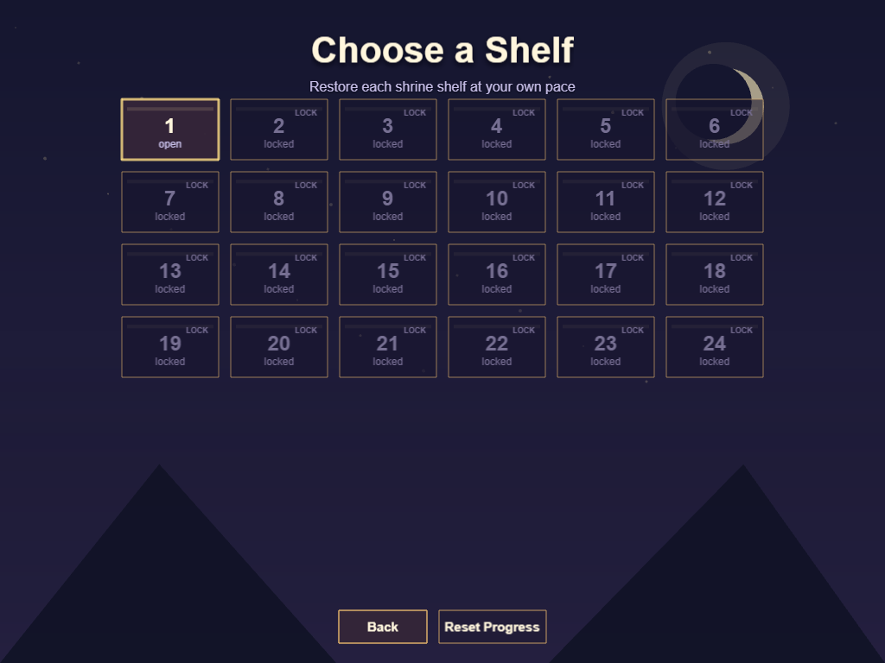
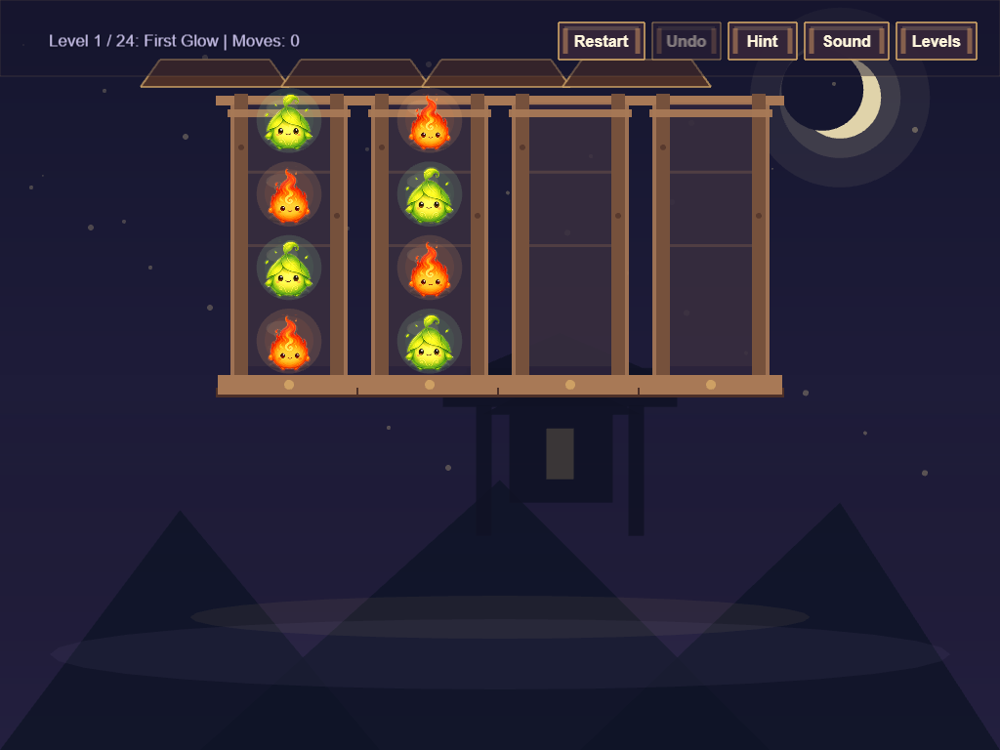
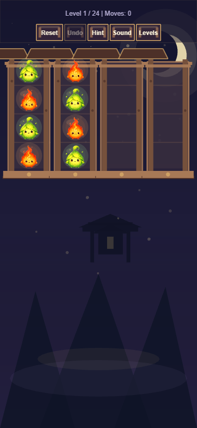

# Spirit Shelf Sort

A cozy magical sorting puzzle game where tiny spirits return to their shrine shelves.

Play the web build at:

```txt
https://mamduh5.github.io/sort-game/
```

## Screenshots









## Features

- 24 handcrafted levels
- Cozy night-shrine theme
- Tiny spirit personalities and soft magical feedback
- Level select with locked, current, and completed states
- Local progress save
- Best move tracking
- Undo
- Hint
- Mute
- Responsive desktop and mobile layout
- Manifest-based spirit PNG asset loading with fallback placeholders

## Controls

- Tap or click a shelf to select its top spirit.
- Tap or click another shelf to move the spirit.
- Use `Undo` to reverse the last move.
- Use `Hint` to highlight a valid move.
- Use `Sound` or `Mute` to toggle audio.
- Use `Levels` to return to level select.

Keyboard shortcuts are also available in gameplay:

- `R`: restart
- `U` or `Backspace`: undo
- `H`: hint
- `M`: mute
- `L`: level select
- `N`: next level when unlocked
- `P`: previous level

## Local Development

```sh
npm install
npm run dev
npm test
npm run build
```

## Deployment

GitHub Pages deployment is handled by GitHub Actions.

Repository settings should use:

```txt
Settings -> Pages -> Source -> GitHub Actions
```

The workflow runs tests, builds the Vite app, uploads `dist`, and deploys to:

```txt
https://mamduh5.github.io/sort-game/
```

## Asset Pipeline

Real spirit PNGs live in:

```txt
public/assets/spirit-sort/spirits/
```

The manifest file is:

```txt
public/assets/spirit-sort/spirits/manifest.json
```

Only files listed in the manifest are requested by the game. Missing manifest entries use code-drawn fallback placeholders, so partial or empty manifests still work.

## Android

Android packaging is planned later after the web build is stable.
